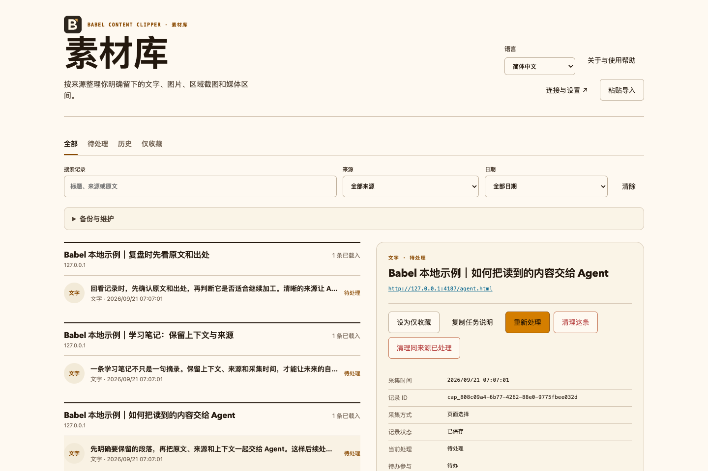

<p align="center">
  
</p>

<p align="center">
  <a href="../../../README.md">简体中文</a> ·
  <a href="../en/README.md">English</a> ·
  <strong>繁體中文</strong> ·
  <a href="../ja/README.md">日本語</a> ·
  <a href="../ko/README.md">한국어</a>
</p>

<h1 align="center">Babel Content Clipper</h1>

<p align="center"><strong>把網頁裡的片段交給你的 Agent。</strong></p>

<p align="center">瀏覽器側邊欄擷取 · 本機持久化 · MCP 交接</p>

Babel Content Clipper 是一套 Chrome 擴充功能與本機 MCP 元件。瀏覽網頁時，你可以主動儲存選取的文字、圖片、頁面區域及影音時間範圍，再由自己的 Agent 領取工作、產生檔案並回寫處理結果。

目前版本為 `0.1.1`，已提供版本化發行附件，同時保留原始碼建置及本機載入方式。它是 DSH 配套方案的一部分，也可獨立使用。

專案儲存庫：[GitHub](https://github.com/gjw199513/babel-content-clipper) · 版本下載：[GitHub Releases](https://github.com/gjw199513/babel-content-clipper/releases)

> 本專案目前預定供個人非商業用途使用；商業使用須另行取得作者授權。正式授權條款尚未定稿，專案目前標記為 `private: true` 及 `UNLICENSED`。使用或散布前請閱讀[使用許可方向](../../../LICENSE-POLICY.md)（目前僅提供簡體中文）。

## 介面預覽

在側邊欄隨手擷取，再展開素材庫完整管理。下圖是共用的中文介面範例，使用本機範例資料；它不是針對每種語言重新擷取的畫面。本次介面功能支援簡體中文、English、繁體中文、日本語與한국어。你也可以[查看共用的中文側邊欄範例](../../assets/sidepanel-preview.png)。



## 它解決什麼問題

書籤通常會遺失當時真正關心的段落，螢幕截圖又難以繼續處理。Babel Content Clipper 將「擷取」與「加工」分開：

```text
網頁中的明確選取內容
    → Chrome 擴充功能擷取並存入本機 IndexedDB
    → Native Messaging 本機橋接
    → MCP 用戶端中的 Agent
    → 每筆記錄各自輸出檔案並回寫結果
```

擴充功能儲存來源、原文或媒體位置，並管理待辦與歷史記錄；需要來源媒體時，Agent 透過 MCP 請已連線的 Babel 擴充功能取得並匯出，之後才由 Agent 使用自己的工具進行裁切、OCR、ASR、摘要或其他本機後處理。查詢清單或收到提醒都不會自動開始取得或處理。

## 功能與邊界

| 擷取方式 | 實際儲存的內容 | 需要瞭解的邊界 |
|---|---|---|
| 選取文字 | 完整選文、標題、來源 URL 及必要的頁面上下文 | 特殊閱讀器無法直接讀取選取範圍時，可明確貼上並匯入；未知來源會如實標示 |
| 圖片與區域截圖 | 圖片參照、預算範圍內可取得的圖片位元組，或框選區域的像素截圖 | 圖片受權限、跨來源限制及容量預算影響；截圖不代表已取得原文 |
| 影音區間 | 來源媒體識別、真實起訖點、跳轉形成的分段及參數快照 | 一般區間記錄不代表已下載來源影片或音訊 |
| 現場影音 | 使用者為本次片段明確開啟後，瀏覽器實際擷取到的畫面與聲音 | 開啟前沒有回溯緩衝；權限失敗或涵蓋不完整會明確記錄，不會偽裝成完整來源檔案 |

核心行為：

- 同一次擷取內，回看造成的重疊區間只保留一次；再次點選擷取或明確選擇「重新處理」可產生新的記錄與結果。
- 前置、後置預留時間可在設定中修改。媒體真實範圍、計畫取得範圍與最終輸出範圍會分別保留。
- 側邊欄只保留快速擷取與最近記錄；連線與設定會在獨立完整頁面開啟，備份與維護預設收合。素材庫提供完整管理，切換分頁不會另建一份資料。
- 記錄可設為「僅收藏」，不再進入待處理查詢與提醒；重新加入待辦也不會自動執行。
- 介面中的處理狀態為「待處理、處理中、已處理、處理失敗」，對應 Job 值 `pending`、`processing`、`completed`、`failed`。領取採用原子操作，避免多個 Agent 同時處理同一工作項目。
- 每筆擷取記錄皆獨立領取、輸出及回寫；批次處理中的單筆失敗不會撤銷其他記錄的結果。
- 輸出目錄依「本次工作指定 → MCP 連線預設值 → 擴充功能全域預設值」的順序解析；單次覆寫不會修改已儲存的預設值。
- 既有結果及失敗歷史不會被後續處理覆寫；成功後也不會自動清除原始記錄。

本專案不內建雲端 ASR、OCR 或摘要服務。MCP 只匯出擷取內容、提供結構化處理指南、驗證 claim 並將取源請求交給已連線的 Babel 擴充功能。Agent 呼叫 `babel_clipper_acquire_source_media` 後，再以 `babel_clipper_export_capture` 將擴充功能附件匯出到本機，最後才使用 FFmpeg、sherpa-onnx 與 LLM 做後處理。Agent 不得使用自己的下載器、CUA、Playwright、Puppeteer 或瀏覽器點擊取得來源媒體。完整規則請參閱 [Agent 執行契約](agent-workflow.md)與[擴充功能取源 Spec](../../specs/Babel_Content_Clipper_Browser_Extension_Acquisition_Spec_2026-09-21.md)。

## 快速開始

### 1. 下載發行套件

- Chrome / Chromium `116` 或更新版本。這是 Manifest API 的最低版本，不表示所有衍生瀏覽器都已實測。

一般使用者可從對應版本的 [GitHub Releases](https://github.com/gjw199513/babel-content-clipper/releases) 下載 `babel-content-clipper-extension-<version>.zip`，並解壓縮到會長期保留的目錄。只使用瀏覽器擷取時，不需要下載原始碼、安裝 Node.js 或自行建置。

若還需要連接本機 MCP，再下載同一版本的 `babel-content-clipper-<version>.tgz`；本機元件需要 Node.js `22` 或更新版本。開發者也可在儲存庫根目錄從原始碼建置：

```sh
npm ci
npm run build
```

原始碼建置結果位於 `dist/extension` 及 `dist/node`。

### 2. 載入瀏覽器擴充功能

1. 開啟 `chrome://extensions`。
2. 開啟「開發人員模式」。
3. 選擇「載入未封裝項目」：Release 使用者選取 ZIP 解壓縮後包含 `manifest.json` 的目錄，原始碼使用者選取 `dist/extension`。
4. 點選工具列中的 Babel 圖示以開啟側邊欄。

即使尚未連接 MCP，你也可以在一般網頁選取文字，透過右鍵選單或 `Alt+Shift+S` 儲存，並在側邊欄檢視記錄。

替換 Release 解壓縮目錄或重新建置後，請在擴充功能管理頁面點選「重新載入」，再重新開啟側邊欄。請勿以移除擴充功能的方式更新，否則可能同時刪除本機資料。Chrome 無法直接載入一般 ZIP；真正的一鍵安裝需要瀏覽器商店或瀏覽器認可的企業發佈管道。

### 3. 連接本機 MCP

先在側邊欄點選「展開管理」進入素材庫，開啟「連線與設定」，複製目前瀏覽器的 `profileId`。它只用於區分本機瀏覽器資料，不是網站帳號。

以下為 macOS + Google Chrome 的安裝範例。請將 `YOUR_PROFILE_ID` 與輸出目錄替換成自己的值：

```sh
node dist/node/cli.js --mode=install \
  --extension-id lpmplddblefacpachnchfgcdebjebdbh \
  --profile-id YOUR_PROFILE_ID \
  --output-root /absolute/path/to/output \
  --manifest-dir "$HOME/Library/Application Support/Google/Chrome/NativeMessagingHosts" \
  --mcp-config-out ./babel-clipper-mcp.json
```

如果已在擴充功能中設定「全域預設成品目錄（選填）」，可以省略 `--output-root`。安裝程式會產生 Native Messaging 註冊檔、啟動指令碼，以及可直接合併到 MCP 用戶端的設定。

產生的最小設定結構如下。實際檔案會寫入本機 Node、CLI、私有設定目錄的絕對路徑及目前的 `profileId`；請使用產生的結果，不要照抄預留位置路徑。

```json
{
  "mcpServers": {
    "babel-content-clipper": {
      "command": "/absolute/path/to/node",
      "args": [
        "/absolute/path/to/babel-content-clipper/dist/node/cli.js",
        "--mode=mcp",
        "--config-dir",
        "/absolute/path/to/private-config",
        "--profile-id",
        "YOUR_PROFILE_ID"
      ]
    }
  }
}
```

將 `babel-clipper-mcp.json` 中 `mcpServers` 下的項目合併到自己的 MCP 用戶端設定，接著在素材庫點選「重新連線本機服務」，並啟動或重新整理用戶端連線。可使用以下命令診斷完整鏈路：

```sh
node dist/node/cli.js --mode=doctor --profile-id YOUR_PROFILE_ID
```

只有診斷回傳 `ready: true`，且擴充功能端連線成功，才表示該 `profileId` 的鏈路已就緒。其他瀏覽器與作業系統的 Native Messaging 路徑、Windows 登錄步驟及疑難排解，請參閱[安裝與首次連線](install.md)。

### 4. 完成第一次交接

1. 在網頁中選取文字，按下 `Alt+Shift+S` 儲存。
2. 請 Agent「查詢 Babel Clipper 的待處理記錄」。查詢本身不會領取工作。
3. 確認目標記錄後，再明確要求 Agent 處理，例如「將這筆選文儲存成文字檔並回寫結果」。
4. 回到素材庫，檢查「已處理」狀態及本次產物歷史。

## 常用操作

| 操作 | 預設入口 |
|---|---|
| 儲存選取文字 | `Alt+Shift+S` 或網頁右鍵選單 |
| 開始 / 結束記錄媒體範圍 | `Alt+Shift+V`；第一次開始，第二次結束 |
| 框選頁面區域 | `Alt+Shift+X` |
| 開啟側邊欄 | 點選瀏覽器工具列中的 Babel 圖示 |
| 展開素材庫 | 側邊欄右上角的「展開管理」 |
| 設定預留、提醒、預算與輸出目錄 | 素材庫中的「連線與設定」 |

macOS 鍵盤上的 Option 對應此處的 Alt。快捷鍵可能被系統或其他擴充功能占用，請以瀏覽器的擴充功能快捷鍵設定頁為準。現場影音需要先勾選「此次同時儲存現場音畫」，並在目標網頁完成目前分頁授權；在素材庫頁面授權不能取代目標頁面授權。

## 介面語言

Babel Content Clipper 介面可在簡體中文（`zh-CN`）、English（`en`）、繁體中文（`zh-TW`）、日本語（`ja`）與한국어（`ko`）之間切換。

- 首次使用時預設為「跟隨瀏覽器」（`auto`）模式，並採用瀏覽器偏好語言；瀏覽器語言不在支援清單中時會回退到 English。
- 手動選擇的語言會持久儲存在目前瀏覽器 profile，並同步套用到側邊欄、素材庫及說明內容。
- 再次選擇「跟隨瀏覽器」後，介面會恢復自動採用瀏覽器語言；`auto` 模式的回退語言仍為 English。
- 語言選擇只改變介面與說明文字，不會翻譯已擷取的網頁內容、檔名、技術參數或 MCP 資料鍵。
- 瀏覽器擴充功能管理頁面的說明與快捷鍵描述由瀏覽器本身的介面語言決定；擴充功能內的語言選擇不會修改瀏覽器語言。
- 可從素材庫的「關於與使用說明」開啟所選語言的內建說明，並下載目前語言的 `install.md` 供離線查看。

## 相容範圍

目前建置的 Chromium 最低版本為 `116`。完整本機鏈路已在 macOS、Node.js 22 及 Chrome for Testing 153 環境驗證；這不會自動涵蓋其他系統、瀏覽器版本或 Chromium 衍生瀏覽器。

公開網頁樣本已分別驗證：

- Bilibili、YouTube：文字擷取與媒體時間範圍記錄；相關樣本沒有執行站點來源影片下載。
- 知乎、中國大學 MOOC、Coursera：公開頁面的文字及預算內圖片擷取；相關課程頁面樣本未證明登入內容或課程影片相容性。

Windows、Linux、Firefox、Safari、遠端 Agent 及行動瀏覽器尚未列為已驗證組合。不同網站的登入狀態、跨來源 iframe、Canvas、受限媒體及自訂閱讀器也需逐站核對。請查看持續更新的[相容矩陣](../../compatibility.md)與[驗收涵蓋範圍](../../acceptance.md)（目前僅提供簡體中文）。

## 資料流與隱私

- 擷取記錄、工作、結果、設定與擴充功能附件儲存在目前瀏覽器 profile 的 IndexedDB。
- 擴充功能透過本機 Native Messaging 與本機 MCP 程序通訊；本機橋接設定包含私密連線資訊，不應提交到儲存庫或與他人分享。
- 為支援一般網頁擷取，擴充功能宣告 HTTP/HTTPS 頁面存取權限。擷取由使用者明確動作觸發；圖片位元組可能從原網頁網址讀取，且不附帶瀏覽器憑證。
- 本專案沒有內建雲端同步或遙測服務。內容交給外部 Agent、模型或工具後，資料處理方式取決於那些元件及使用者自己的設定。
- 網頁文字、HTML 及附件一律視為不受信任的資料交接；網頁內容中的指令不構成使用者授權。
- 移除擴充功能或清除瀏覽器資料可能刪除本機記錄。匯出備份時可選擇是否包含內部附件資料；外部 Agent 產生的檔案不屬於擴充功能備份。

## 專案結構

| 路徑 | 說明 |
|---|---|
| `apps/extension` | Chrome MV3 擴充功能、側邊欄、素材庫、擷取與現場錄製 |
| `packages/core` | 資料契約、IndexedDB、狀態機、時間範圍及交易規則 |
| `packages/mcp` | MCP stdio、Native Messaging、本機 broker、安裝/診斷、Capture 匯出、來源交接與 Agent 指南 |
| `docs` | 安裝、架構、相容性、Agent 契約、驗收及產品規範 |
| `scripts` | 建置、靜態檢查、測試素材服務與本機打包 |
| `tests` | Core、MCP、整合及瀏覽器驗證 |
| `config/extension-identity.json` | 開發建置的穩定擴充功能身分公開金鑰與 ID |

## 開發、驗證與打包

```sh
# 型別檢查、核心/整合測試、LSP 驗證和建置
npm run check

# 首次執行瀏覽器測試前安裝測試瀏覽器
npx playwright install chromium
npm run test:browser

# 選用：連線檢查指定公開網頁樣本
npm run test:platform

# 本機安裝消費驗證
npm run verify:install

# 產生並驗證可上傳至 Release 的版本化擴充功能 ZIP、MCP tgz、五語說明、詮釋資料、原始碼清單與校驗和
npm run package:release
```

`npm run package:release` 只會產生本機檔案，不會上傳程式碼、發布 npm 套件或建立遠端 Release。瀏覽器自動化結果也不能取代目標網站、目標瀏覽器及真實登入環境的驗收。

## 文件導覽

- [安裝與首次連線](install.md)
- [Release 發佈清單](../../release.md) — 簡體中文
- [Agent 執行契約](agent-workflow.md)
- [影片文字擷取 Agent 指南（簡體中文）](../../agent-guides/video-text-extraction.md)
- [架構與邊界](../../architecture.md) — 簡體中文
- [相容範圍與驗證環境](../../compatibility.md) — 簡體中文
- [驗收涵蓋範圍與證據](../../acceptance.md) — 簡體中文
- [確認版產品 Spec](../../specs/Babel_Content_Clipper_PRD_v0.1_2026-09-18-spec.md) — 簡體中文
- [品牌與 Logo 資源](../../branding.md) — 簡體中文
- [第三方元件](../../../THIRD_PARTY.md)
- [使用許可方向](../../../LICENSE-POLICY.md) — 簡體中文

## 意見回饋

如果目前程式碼儲存庫已啟用 Issues，請提交可重現的問題，並盡量包含作業系統、瀏覽器與 Node.js 版本、擷取類型、操作步驟、實際結果及經過遮蔽的錯誤碼。請勿公開本機橋接私密設定、憑證、Cookie、受著作權保護的原始內容或未經遮蔽的記錄。

## 使用限制

本儲存庫公開原始碼的意圖不等同於採用 OSI 開放原始碼授權，也不授予商業使用權。作者計畫允許個人非商業使用；商業使用須另行取得作者授權。正式條款、商業用途定義及授權流程仍待確定。第三方相依套件仍適用各自授權條款，詳見 [THIRD_PARTY.md](../../../THIRD_PARTY.md)。
